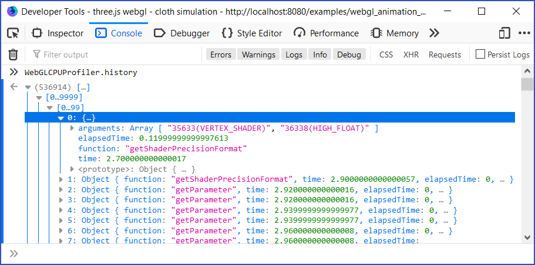
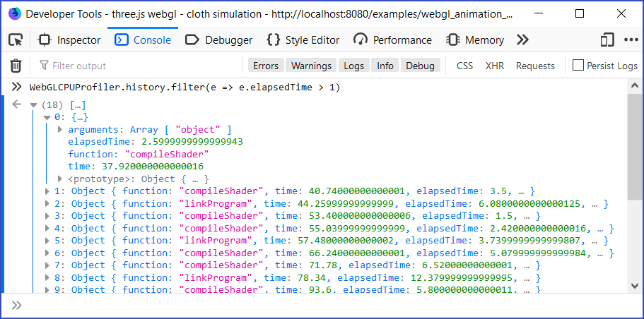
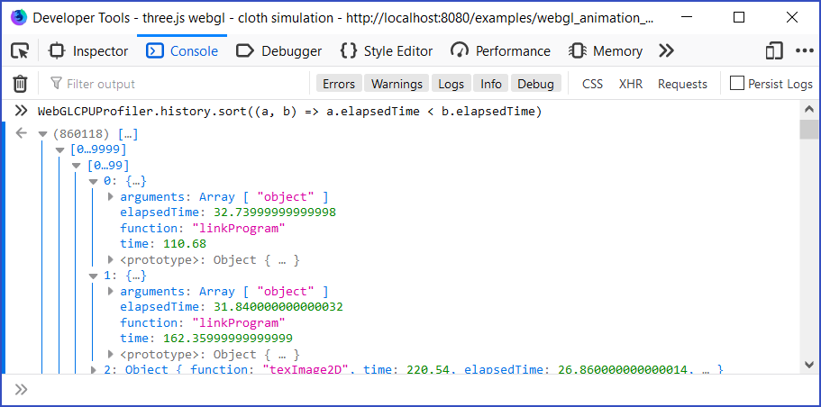

# WebGL-CPU-Profiler-Extension

WebGL-CPU-Profiler-Extension is WebExtension profiling CPU side for WebGL call.

## Install

Download this project and install extension to your browser. This extension is in development. I recommend temporary/Developer mode installation.

### FireFox

[Temporary installation in Firefox](https://developer.mozilla.org/en-US/docs/Mozilla/Add-ons/WebExtensions/Temporary_Installation_in_Firefox)

I recommend to set privacy.reduceTimerPrecision false via [about:config](about:config) for this extension. But of course please understand the risk of that.

### Chrome

[Getting Started Tutorial](https://developer.chrome.com/extensions/getstarted)

### Other browsers

T.B.D.

## Usage

After install the extension, go to WebGL application page (for example, [Three.js example](https://threejs.org/examples/webgl_animation_cloth.html)), and open the console.

You can access WebGL call history with `WebGLCPUProfiler.history`. It's an JavaScript array so that you can filter, sort, and so on.

## License 

MIT License
